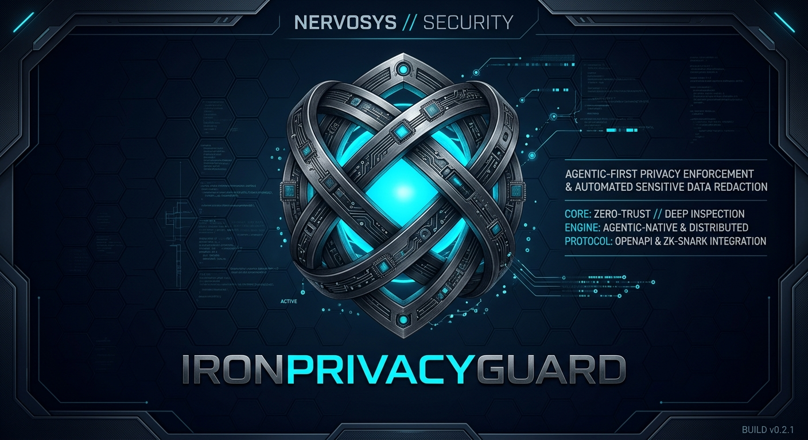

IronPrivacyGuard (IPG) is an agent-first privacy tool written in Rust, built on
[IronCrypto](https://github.com/nervosys/IronCrypto). Its command is `ipg`, its Rust
library is `iron_privacy_guard`, and its file formats, MCP tools and protocol keep
the `ipg` prefix. It provides a working native
alternative for core GPG workflows: generate identities, export public keys,
encrypt/decrypt files, and sign/verify exact bytes. Every operation is described by
machine-readable contracts, JSON Schema, and a JSON-LD ontology. Agents can use
the embedded cryptography knowledgebase to find tools by application, then
validate and plan requests before execution.

The CLI exposes 58 operations through direct commands, JSON calls, NDJSON streams,
and MCP stdio. It includes password-protected identities, hybrid post-quantum
encryption, non-exportable identities on PKCS#11 tokens, HSMs, TPM 2.0 and AWS KMS, detached
signatures, signed revocation and validity certificates, and pinned immutable trust
snapshots.

**IronPrivacyGuard 0.2.0 is an experimental pre-1.0 release.** It is not an
audited or drop-in GPG replacement.
Native IPG keys, envelopes and signatures are not OpenPGP. A separate
[OpenPGP boundary](docs/OPENPGP.md) exchanges encrypted files and detached
signatures with GnuPG. The native IPG protocol needs independent cryptographic
review before high-value production use.

**IronCrypto is the only dependency.** Every build, including all optional
integrations, depends only on IronCrypto and first-party IPG crates: OpenPGP,
PKCS#11, TPM, attestation and AWS KMS (over IPG's own TLS 1.3 client) included.
Core software workflows require no external cryptographic programs or services.
See [dependency boundaries](docs/DEPENDENCIES.md).

Install the CLI from [crates.io](https://crates.io/crates/ipg):

```sh
cargo install ipg --version 0.2.0 --locked
```

This installs the 0.2.0 CLI, including native OpenPGP. Hardware and cloud
integrations are optional Cargo features; see their sections below. Prebuilt release binaries and
checksums are published on the [GitHub releases page](https://github.com/nervosys/IronPrivacyGuard/releases).

## Build

Requires Rust 1.88 or later and Cargo.

```sh
cargo build --release --locked --target-dir target
cargo test --locked --target-dir target
cargo clippy --locked --all-targets --target-dir target -- -D warnings
```

The executable is `target/release/ipg` (`ipg.exe` on Windows). To install the
current checkout instead, run `cargo install --path . --locked`. IronCrypto
components are pinned to crates.io release `0.2.10`, and Cargo.lock pins the
remaining dependency graph for this repository.
Native IPG identity and envelope cryptography uses IronCrypto. There is no OpenSSL, C
compilation, TLS library, GPG subprocess, or external cryptographic executable. OS
entropy and filesystem access use platform APIs through IronCrypto and the Rust
standard library.

Hardware-backed identities need the optional `pkcs11` feature, which loads a
host-selected PKCS#11 module at runtime (still no C compilation). Contracts,
schemas and formats are identical with or without it:

```sh
cargo build --release --locked --features pkcs11 --target-dir target
```

AWS KMS identities need the `kms` feature (still no C compilation: TLS uses IPG's
native TLS 1.3 client on IronCrypto). TPM 2.0 identities need the `tpm` feature: Linux uses
IPG's native TPM command layer; Windows uses TPM Base Services through the small
`ipg-cng` crate. Native FFI is isolated in `ipg-cng` and `ipg-pkcs11`. See
[hardware identities](docs/HARDWARE.md#tpm-20). TPM keys can be attested to a
verifier holding only the manufacturer's root certificates; the verifier needs the
`attestation` feature, which `tpm` includes. See [TPM key attestation](docs/ATTESTATION.md).

The standalone `x509-native` feature provides [offline certificate checks](docs/X509.md)
for Rust callers using only IronCrypto and first-party crates. The `tls-native`
feature adds an [experimental TLS 1.3 Rust client](docs/TLS.md) with a bounded
profile; the `kms` feature uses it with [bundled public trust-anchor data](data/README.md).

Native OpenPGP is enabled by default; `--no-default-features` omits it, and
`openpgp` remains as an alias. It implements RFC 9580 packets and policy over
IronCrypto, including RSA, NIST-curve, Ed448 and X448 correspondents; see
[OpenPGP interoperability](docs/OPENPGP.md).

External MCP integration tests use the official Python and TypeScript SDKs to
exercise the release binary. Python and Node.js are test tooling only. See
[the interoperability checks](docs/MCP.md#external-client-interoperability)
for setup and coverage. CI runs Rust tests and both SDK checks.

## Agent bootstrap

```sh
ipg discover
ipg schema
ipg ontology
ipg algorithms
ipg knowledge
ipg knowledge search --query "confidential file"
```

All commands emit a single JSON response on stdout, including errors. No prompts,
terminal coloring, banners, or plaintext payloads share the control channel.
`discover` enumerates operations, effects, constraints, limits, retry guidance and
unsupported features. `schema` derives the request and artifact shapes from Rust
types. `ontology` exports the IPG knowledge graph. `algorithms` exports IronCrypto's
upstream catalog; catalog membership does not enable an IPG algorithm or suite.
`knowledge` provides centralized application guidance with prerequisites, limitations,
source references and ontology links to executable tools. `knowledge search` finds
matching applications and explicitly identifies unsupported use cases. See the
[cryptography knowledgebase](docs/KNOWLEDGE.md).

CLI operation groups use subcommands, such as `ipg key generate`,
`ipg request validate`, and `ipg trust compare`. Dotted aliases remain supported
for compatibility. JSON requests and MCP allowlists use dotted operation names.

For structured invocation, write a JSON `Call` to `ipg call` on stdin:

```json
{"protocol":"ipg/1","id":"task-42","request":{"operation":"hash","input":"message.bin"}}
```

For a persistent process, use `ipg serve`: one Call per newline, one response per
newline, in order. Request IDs are echoed. This is a native NDJSON protocol, not
MCP or JSON-RPC. See [the protocol](docs/PROTOCOL.md).

For MCP clients, use `ipg mcp`. It exposes all 58 operations as tools named
`ipg_discover`, `ipg_knowledge`, `ipg_knowledge_search`, `ipg_key_generate`, and so on, with generated schemas.
The host can restrict tools and pin mandatory policy at startup:

```sh
ipg mcp --allow discover,schema,ontology,knowledge,knowledge.search,request.validate,plan,encrypt,sign,verify --trust-store trust-active.json --expected-store-digest <active-digest>
```

This injects the pinned policy into encryption, signing and verification even if
the caller omits it or supplies null. Attempts to replace it fail. See
[MCP setup and protocol](docs/MCP.md) for client configuration and boundaries.

Plan without opening files or reading secrets:

```json
{"protocol":"ipg/1","id":"plan-1","request":{"operation":"plan","request":{"operation":"encrypt","input":"message.bin","output":"message.ipg.json","recipient":"alice.public.json","expected_fingerprint":"<trusted 64-character fingerprint>"}}}
```

A plan describes effects and constraints. It does not reserve outputs, check file
availability, authorize a request, or promise execution will succeed.

## Cryptography knowledgebase

The embedded, offline knowledgebase covers **17 applications and twelve primitives**.
It connects security goals to IPG tool contracts, prerequisites, limitations and
source references through the ontology.

```sh
ipg knowledge
ipg knowledge search --query "confidential file"
ipg knowledge search --query "password database"
ipg knowledge search --query "openpgp"
```

| Application | IPG tools or support status |
| --- | --- |
| Confidential file transfer | `encrypt`, `decrypt` |
| Large files or several recipients | `stream.encrypt`, `stream.decrypt` |
| Authenticate file contents | `sign`, `verify`; `stream.sign`, `stream.verify` for any-size files |
| File digest | `hash` |
| Protect private identities | `key.generate`, `key.public`, `key.rewrap` |
| Manage trust and lifecycle | `trust.*`, `key.revoke`, `key.validity`, certificate verification |
| Authenticated, confidential messages between agents | `message.seal`, `message.open` |
| Delegate scoped authority to agents | `grant.issue`, `grant.verify`, then `verify` or `stream.verify` with `delegation` |
| Identify native artifacts | `inspect` |
| Hardware key custody (PKCS#11 tokens, HSMs, TPM 2.0) | `hardware.*` or `tpm.*`, then any key operation with the key file |
| Prove keys are resident in a genuine TPM | `tpm.attest`, `tpm.attestation.challenge`, `tpm.attestation.respond`, `tpm.attestation.verify` |
| Managed key custody (AWS KMS), optionally with composite ML-DSA-65 signatures | `kms.key.bind`, then any key operation with the key file |
| Post-quantum confidentiality and signatures (hybrid ML-KEM-768 + X25519, Ed25519 + ML-DSA-65) | `key.generate --identity ipg-public-hybrid-v1`, then `encrypt`, `decrypt`, `sign`, `verify` |
| Exchange with GnuPG and other OpenPGP tools (default `openpgp-native` feature) | `openpgp.key.generate`, `openpgp.cert.export`, `openpgp.cert.inspect`, `openpgp.encrypt`, `openpgp.decrypt`, `openpgp.sign`, `openpgp.verify`, `openpgp.message.verify` |
| TLS, password-verifier storage, FIPS validation | `external_required`; no executable IPG tools |

Search returns matches under `result.document.matches`. Each match contains an
`application` and its `tools`. Check `application.support`, `prerequisites` and
`limitations` before selecting a command. Search uses case-insensitive keyword
matching; unknown terms return `status: "no_match"`. Results are advisory and do
not execute or authorize operations.

An agent workflow is: **discover → search → inspect contracts → validate → plan →
execute**. The native request for a search is:

```json
{"protocol":"ipg/1","id":"find-tools","request":{"operation":"knowledge.search","query":"confidential file"}}
```

MCP exposes the same operations as `ipg_knowledge` and `ipg_knowledge_search`. See the
[knowledgebase guide](docs/KNOWLEDGE.md) for matching rules and maintenance.

## Request validation and inspection

### Schema preflight
Generated contracts encode fixed versions and algorithms, canonical pin/key hex,
Unix-time bounds and trust-store capacity. Agents can validate requests locally
before calling IPG. Schema acceptance does not authenticate an artifact or authorize
an operation. `plan` checks typed request shape only; it does not run a full JSON
Schema validator. See [SCHEMAS.md](docs/SCHEMAS.md) for guarantees and runtime checks.

### Built-in request preflight
`ipg request validate --request '{"operation":"hash","input":"message.bin"}'`
checks request shape and static semantics without reading files or executing the
candidate. Read `result.validation.valid` and its JSON Pointer diagnostics; this
command returns a successful response even when it finds invalid input. MCP exposes
`ipg_request_validate`. See [preflight guarantees](docs/SCHEMAS.md#built-in-request-preflight).

### Structural inspection
`inspect` rejects malformed artifact encodings and duplicate JSON fields. Successful
results include `structurally_valid: true` and `authenticated: false`: valid shape
is not proof of authenticity. See [inspection guarantees](docs/SCHEMAS.md#structural-artifact-inspection).

Native calls, MCP messages and JSON-valued CLI flags reject duplicate JSON members
at every depth before dispatch, including escaped names and raw preflight inputs.
See the [control protocol](docs/PROTOCOL.md) and [MCP duplicate-member policy](docs/MCP.md#duplicate-member-policy).

## File workflow

Provision `passphrase.bin` through your secret manager or another protected
channel. It must contain 16–4096 bytes. Exact bytes are used, including any trailing
newline. Keep this file and output directories private to the executing identity.

```sh
ipg key generate --output alice.ipg-secret.json --passphrase-file passphrase.bin
ipg key public --key alice.ipg-secret.json --output alice.public.json --passphrase-file passphrase.bin
ipg inspect --input alice.public.json
```

For post-quantum protection, add `--identity ipg-public-hybrid-v1`. The identity
combines ML-KEM-768 with X25519 for encryption and ML-DSA-65 with Ed25519 for
composite signatures and certificates, so each stays secure if either component is
broken. Every other command is unchanged.

The generation response includes the public fingerprint. Distribute the public
file freely, and establish its fingerprint through a trusted channel. Inspection
alone never authenticates a key or its owner.

```sh
ipg encrypt --input message.bin --output message.ipg.json --recipient alice.public.json --expected-fingerprint <trusted-fingerprint>
ipg decrypt --input message.ipg.json --output recovered.bin --key alice.ipg-secret.json --passphrase-file passphrase.bin
ipg sign --input message.bin --output message.sig.json --key alice.ipg-secret.json --passphrase-file passphrase.bin
ipg verify --input message.bin --signature message.sig.json --signer alice.public.json --expected-fingerprint <trusted-fingerprint>
ipg hash --input message.bin
```

The `<trusted-fingerprint>` notation is a placeholder, not literal shell syntax.
Existing output paths are never replaced. There is intentionally no `--force`.
Passphrases and private keys are never returned in JSON responses. Decryption
writes plaintext only after successful authentication.

## Large files and multiple recipients

`encrypt` writes a single-recipient JSON envelope. For files of any size or up to 64
recipients, `stream.encrypt` writes an `ipg-stream-v1` stream of authenticated 64 KiB
chunks; each recipient decrypts with `stream.decrypt` and its own key:

```sh
ipg stream encrypt --input backup.tar --output backup.ipgs --recipients '[{"public":"alice.public.json","expected_fingerprint":"<alice>"},{"public":"ops.public.json","expected_fingerprint":"<ops>"}]'
ipg stream decrypt --input backup.ipgs --output backup.tar --key alice.json --passphrase-file pass.bin
```

Plaintext is written to a temporary file and published only after the last chunk
authenticates, so truncated or altered streams never produce output. Recipients may
mix identity suites and key providers. Streams do not authenticate the sender; see
[the stream format](docs/FORMAT.md#multi-recipient-stream-ipg-stream-v1).

## Key lifecycle

Reprotect an existing identity with a new passphrase, preserving its fingerprint,
encryption key and signing key:

```sh
ipg key rewrap --key alice.ipg-secret.json --output alice-new.ipg-secret.json --expected-fingerprint <trusted-fingerprint> --passphrase-file passphrase.bin --new-passphrase-file new-passphrase.bin
```

The output uses a fresh salt and nonce. The source remains unchanged and still
works with the old passphrase. Rewrapping does not recover a compromised key;
generate a new identity in that situation. Retirement of old copies and backups
is a separate caller-managed action.

Create and authenticate a portable self-revocation statement:

```sh
ipg key revoke --key alice.ipg-secret.json --output alice.revocation.json --expected-fingerprint <trusted-fingerprint> --passphrase-file passphrase.bin --reason compromised
ipg revocation verify --input alice.revocation.json --signer alice.public.json --expected-fingerprint <trusted-fingerprint>
```

Reasons are `compromised`, `superseded`, or `retired`. The statement covers both
keys of the identity. Verification returns `authenticated: true` and
`policy_applied: false`. Creation and verification alone do not publish a
certificate or disable the key. Import the certificate into a trust snapshot and
pass that snapshot as a policy to enforce revocation. See
[the lifecycle specification](docs/LIFECYCLE.md).

## Explicit trust policy

Create a snapshot, enroll an independently pinned public identity, and retain the
returned digest in the orchestrator's trusted configuration:

```sh
ipg trust init --output trust-empty.json
ipg trust add --store trust-empty.json --expected-digest <empty-digest> --public alice.public.json --expected-fingerprint <trusted-fingerprint> --output trust-active.json
ipg trust revoke --store trust-active.json --expected-digest <active-digest> --input alice.revocation.json --expected-fingerprint <trusted-fingerprint> --output trust-revoked.json
ipg trust status --store trust-revoked.json --expected-digest <revoked-digest> --expected-fingerprint <trusted-fingerprint>
```

Every update creates a new file and returns a new digest; no update clears an
existing revocation. Snapshots are written as `ipg-trust-v3` with SHA-384 digests;
older v1 and v2 snapshots and their SHA-256 pins remain readable. `encrypt`, `sign`, and `verify` accept an optional `policy`
object containing `store` and `expected_digest`:

```json
{"protocol":"ipg/1","id":"governed-encryption","request":{"operation":"encrypt","input":"message.bin","output":"message.ipg.json","recipient":"alice.public.json","expected_fingerprint":"<trusted-fingerprint>","policy":{"store":"trust-revoked.json","expected_digest":"<revoked-digest>"}}}
```

This request fails with `key_revoked`. Missing, corrupt or mismatched requested
snapshots also fail; they never fall back to ungoverned execution. Successful
governed operations report `policy_digest`; omission or null `policy` means no
trust-store enforcement and returns `policy_digest: null`. The CLI accepts the
same object as a JSON string in `--policy`.

Callers must supply policy and retain the latest digest outside the store.
Snapshots do not prove freshness; an old snapshot and its matching old digest
remain usable. Decryption stays available for historical data. Read
[trust-store semantics](docs/TRUST.md) for publication, concurrency and recovery.

### Expiry policies
Create signed validity with `key.validity`, authenticate it with `validity.verify`,
and import it using `trust.validity`. Imports publish new pinned snapshots and can
only narrow existing windows. `trust.evaluate --store snapshot.json
--expected-digest DIGEST --expected-fingerprint FINGERPRINT --at-time 1800000000`
is advisory. Governed encrypt/sign/verify use host time and report
`policy_checked_at`; callers cannot backdate enforcement. See [trust and validity
semantics](docs/TRUST.md). Identities without imported validity have no expiry.

### Reconciling agent trust updates
`trust.compare` explains differences between two pinned snapshots. `trust.merge`
combines explicitly trusted branches into a new file, retaining revocations and
narrower signed validity windows. Conflicting windows fail without publication.
The orchestrator still controls the current policy pin and approves new identities.
See [branch reconciliation](docs/TRUST.md#comparing-and-reconciling-branches).

## Delegating authority to agents

A root principal can delegate scoped authority to an agent identity with a
signed `ipg-grant-v1` grant: named operations (`sign`, `stream.sign`, `decrypt`,
`stream.decrypt`), optional purposes, a time window and a re-delegation depth.
Agents may pass narrower slices to sub-agents; every link can only narrow its
parent. Relying parties add a `delegation` requirement to `verify` or
`stream.verify` so a signature counts only if the signer's chain verifies back
to the pinned root at the host clock. An MCP host can pin a grant for a whole
session with `--grant`, confining private-key use to the delegated identity and
operations. See [delegation grants](docs/DELEGATION.md).

## Inline data for agents

Small payloads need no temporary files: any input path may be a
`data:...;base64,` URI (up to 1 MiB), and any non-streaming output may be
`return:<name>`, which returns the bytes base64-encoded in the response.
Passphrases and PINs must still come from protected files, and MCP hosts can
disable inline data with `--inline-data deny`. See
[inline data](docs/PROTOCOL.md#inline-data-and-returned-outputs).

## Messages between agents

`message.seal` signs and encrypts content to one pinned recipient, binding the
sender, recipient, a random message ID, an optional conversation label, a
lifetime of up to one day, an optional channel binding (such as a TLS exporter
value) and an optional attached delegation grant. `message.open` authenticates
all of it from a pinned sender before releasing content, and with a replay
directory refuses a second open of the same message. See [agent messages](docs/MESSAGES.md).

## Any-size detached signatures

Any-size detached native signatures use a separate `ipg-stream-signature-v1`
format. `stream.sign` hashes input in 64 KiB buffers and signs a domain-separated
SHA-384 digest and byte count; `stream.verify` verifies the commitment and reads
the exact original bytes with the same bounded memory. Both accept native trust
policy, and signing supports every existing identity provider. This protocol is
not Ed25519ph, HashML-DSA or OpenPGP and requires independent review.

```sh
ipg stream sign --input large.bin --output large.sig.json --key me.json --passphrase-file pass.bin
ipg stream verify --input large.bin --signature large.sig.json --signer me.public.json --expected-fingerprint <trusted-fingerprint>
```

## Hardware-backed identities

With a `pkcs11` build and the host's `IPG_PKCS11_MODULE` set to the absolute path
of a PKCS#11 module, an identity can live on a token or HSM. The token generates
non-exportable P-384 keys; IPG writes only a public reference file:

```sh
ipg hardware tokens
ipg hardware key generate --token-serial <serial> --label alice --output alice.pkcs11.json --pin-file pin.bin
ipg key public --key alice.pkcs11.json --output alice.public.json --passphrase-file pin.bin
ipg sign --input release.tar --output release.sig.json --key alice.pkcs11.json --passphrase-file pin.bin
```

The reference works as the `key` of `decrypt`, `sign`, `key.public`, `key.revoke`
and `key.validity`; `passphrase_file` then holds the token PIN. Public
identities, envelopes, signatures, certificates and trust snapshots work exactly as
for software identities. `hardware.key.bind` adopts keys created by vendor tooling.
Requests can never name a module, IPG proves token possession before writing a reference, and
`ipg mcp --key-custody non-exportable` (or `hardware`) refuses weaker keys for a session. Token
attributes are self-reported, not attested. See [hardware identities](docs/HARDWARE.md).

## OpenPGP interoperability

IPG generates v4 (default) or v6 OpenPGP keys (Ed25519, or P-384 for
CNSA-aligned use), exports their certificates, encrypts to up to 32 pinned
certificates, decrypts, and creates and verifies detached signatures.
Correspondents may use RSA 2048-4096, P-256/P-384/P-521, Ed25519, Ed448,
Curve25519, Curve448, X25519 or X448 keys, including GnuPG's LibrePGP v5 keys,
and send AES-128/192/256 messages using SEIPDv1 or SEIPDv2 with EAX, OCB or
GCM, compressed with ZIP, ZLIB or BZip2. Old messages and protected keys using
IDEA, TripleDES, CAST5, Blowfish, Twofish or Camellia can be read, never written. Output
from the default v4 path interoperates with GnuPG 2.2 and later. Select v6 with
`--key-version v6` for correspondents supporting RFC 9580 and SEIPDv2/OCB.

```sh
ipg openpgp key generate --output me.json --passphrase-file pass.bin --user-id "Me <me@example.org>" --algorithm p384
ipg openpgp cert export --key me.json --output me.asc
ipg openpgp cert inspect --input them.asc
ipg openpgp verify --input report.pdf --signature report.pdf.asc --certificate them.asc --expected-openpgp-fingerprint <40-hex>
```

Certificates are pinned by fingerprint in `expected_openpgp_fingerprint`; IPG trust
snapshots do not apply to them. IPG enforces its own certificate policy: valid
binding and back signatures, expiry, revocation, and no SHA-1, weak RSA, DSA or
ElGamal. `openpgp.key.export` writes a pinned key as a passphrase-protected OpenPGP
private-key file for migration or backup. `openpgp.key.import` imports a pinned v4 or v6
Ed25519/Curve25519 or P-384 key with one signing primary and one encryption subkey. See
[OpenPGP interoperability](docs/OPENPGP.md).

## Ontology and implementation

The ontology covers every implemented operation and its inputs, outputs, effects,
algorithm references, safety constraints and retry semantics. It also describes
artifact entities, sensitivity, errors, exit codes, and ordered workflows.
Generated schemas define the exact accepted parameter names and artifact fields.
Tests check that the ontology and request enum cover the same operations, that
graph references resolve, and that algorithm references exist in IronCrypto.

Standalone exports are checked in at [ontology/ipg.jsonld](ontology/ipg.jsonld),
[ontology/knowledge.jsonld](ontology/knowledge.jsonld), and [schemas/](schemas/). Regenerate them with
`cargo run --locked --target-dir target --example export_contracts` after changing
contracts. Each named
schema (`call`, `request`, `outcome`, `response`) is independently usable; the
`formats.json` file contains independently usable artifact and knowledge-application schemas.

| Module | Responsibility |
| --- | --- |
| `src/crypto.rs` | Native formats, identity suites, domain separation, key protection, IronCrypto calls |
| `src/provider.rs` | Key inputs, hardware references, PIN rules, host custody policy |
| `src/pkcs11.rs` | PKCS#11 backend (`pkcs11` feature): token selection, key checks, signing and ECDH |
| `src/cng.rs` | Earlier Windows TPM keys (ipg-cng-key-v1) through the Platform Crypto Provider |
| `src/tpm2/` | IPG's TPM 2.0 layer: marshalling, salted HMAC sessions, KDFa, RSA-OAEP, MakeCredential |
| `src/tpm_native.rs` | Native TPM keys through Linux device/loopback swtpm or Windows TBS, and the attestation prover |
| `src/attest.rs` | TPM key attestation formats and verifier (EK chain, TPM2_Certify, credential challenge) |
| `src/x509.rs`, `src/x509/` | Bounded certificate parsing, signatures, EK paths and TLS server-identity checks |
| `src/tls_roots.rs`, `data/tls-roots.json` | Bundled KMS HTTPS trust anchors with pinned provenance and preserved constraints |
| `src/stream.rs` | ipg-stream-v1: multi-recipient streaming encryption |
| `src/stream_signature.rs` | ipg-stream-signature-v1: any-size detached signatures over SHA-384 commitments |
| `crates/ipg-cng` | Minimal safe wrapper over Windows CNG and TBS |
| `crates/ipg-pkcs11` | Native PKCS#11 FFI, bounded buffers, and session ownership |
| `src/kms.rs` | AWS KMS backend (`kms` feature): SigV4 over native TLS 1.3, Sign and DeriveSharedSecret |
| `src/tls/` | Experimental bounded TLS 1.3 client (`tls-native`): X25519/P-256/P-384, record protection, key schedule |
| `src/openpgp/` | OpenPGP boundary over IronCrypto: packets, certificate policy, CFB/EAX/OCB/GCM messages, RSA/DSA/prehash-ECDSA (`public.rs`) and Ed448/X448 (`curve448.rs`) |
| `src/lifecycle.rs` | Signed revocation and validity certificates |
| `src/message.rs` | ipg-message-v1 agent messages: sealing, opening checks, replay markers |
| `src/delegation.rs` | ipg-grant-v1 delegation chains: issue, attenuation, verification and host pinning |
| `src/trust.rs` | Immutable snapshots, digest pins, revocation and expiry policy |
| `src/reconciliation.rs` | Pinned snapshot comparison and conservative merging |
| `src/knowledge.rs` | Embedded knowledgebase, application search and ontology nodes |
| `knowledge/` | Curated application guidance and primitive references |
| `src/validation.rs` | Request preflight with JSON Pointer diagnostics |
| `src/control_json.rs` | Strict JSON decoding with duplicate-member rejection |
| `src/mcp.rs` | MCP lifecycle, generated tool catalog, host controls, dispatch |
| `src/transport.rs` | Bounded newline framing shared by both stdio transports |
| `src/lib.rs` | Typed operations, bounded file I/O, no-clobber publication, response protocol |
| `src/ontology.rs` | Capability contracts and JSON-LD graph |
| `src/main.rs` | CLI arguments, JSON calls, bounded NDJSON framing |
| `tests/knowledge.rs` | Application routing, graph integrity, query bounds and CLI checks |
| `tests/security.rs` | Security regressions, workflow and protocol tests |
| `tests/lifecycle.rs` | Rewrapping, certificate tampering, signature separation, CLI lifecycle |
| `tests/messages.rs` | Message binding, replay, tampering, attached delegation and host-pinned grants |
| `tests/delegation.rs` | Grant issue, attenuation, verification requirements, expiry and host-pinned sessions |
| `tests/trust.rs` | Policy enforcement, snapshot tampering, monotonic revocation, publication |
| `tests/mcp.rs` | MCP subprocess sessions, schemas, allowlists, mandatory policy, rate limits |
| `tests/hardware.rs` | Fail-closed hardware configuration, custody policy, pre-login checks |
| `tests/pkcs11_live.rs` | Full hardware lifecycle against a real module (opt-in, disposable token) |
| `tests/tpm_live.rs` | Full TPM lifecycle (opt-in; swtpm via `scripts/tpm-test.sh`) |
| `tests/windows_tpm_live.rs` | ipg-cng-key-v1 lifecycle on the machine's real TPM (opt-in, self-cleaning) |
| `tests/tpm_attest_live.rs` | TPM identity and attestation round trip (swtpm or a real TPM, opt-in) |
| `tests/attestation.rs` | Offline attestation verification and tamper rejection with swtpm evidence |
| `tests/stream.rs`, `tests/vectors_stream.rs` | Stream round trips, chunk boundaries, tampering, and PyCA-made streams |
| `tests/stream_signatures.rs`, `tests/vectors_stream_signatures.rs` | Any-size signature round trips, tampering, policy and independent all-suite vectors |
| `tests/openpgp.rs` | OpenPGP round trips, pins, tampering, custody, MCP exposure and independent certificate-policy/work-limit regressions |
| `tests/interop/gnupg_reference.py` | Two-way GnuPG interoperability and certificate-policy refusals |
| `tests/interop/openpgp_recipient_reference.py` | PyCA checks of RSA/NIST/X25519/X448 recipients and AES-128/192/256 EAX/OCB/GCM messages |
| `tests/vectors_hybrid.rs` | PyCA/OpenSSL-generated hybrid post-quantum vectors |
| `tests/vectors_p384.rs` | PyCA-generated P-384 suite vectors |

Read [the format specification](docs/FORMAT.md), [security model](SECURITY.md),
and [roadmap](docs/ROADMAP.md) before extending the protocol.

## Validation and testing

### Independent format checks
[Public cryptographic test vectors](tests/vectors/native-v1.json) and
[P-384 suite vectors](tests/vectors/native-p384-v1.json) are generated with PyCA
cryptography independently of IronCrypto. `cargo test --locked` checks
them without Python. The separate reference suite regenerates expected values in
memory and exercises the release CLI in both directions. See [vector coverage and
reproduction](docs/VECTORS.md). Production code and dependencies remain Rust.
Hardware support runs end to end against SoftHSMv2 with `scripts/softhsm-test.sh`;
see [testing hardware identities](docs/HARDWARE.md#testing).

### Boundary fuzz testing
Seven isolated cargo-fuzz targets cover native requests, NDJSON framing, artifact
validation, MCP session handling, stream headers, TPM structures and public OpenPGP
certificate/signature packets. Curated seeds and deterministic mutations
also run under ordinary `cargo test`; no nightly toolchain is needed for replay.
See [FUZZING.md](docs/FUZZING.md) for sanitizer setup, scope and bounded runs.

## License

IPG is dual-licensed, on the same terms as IronCrypto:

- **[AGPL-3.0-or-later](LICENSE)** for open-source use. The network clause has real
  reach: exposing IPG to remote users or agents through a hosted service makes that
  service a derivative work.
- **[Commercial](LICENSE-COMMERCIAL.md)** for proprietary, embedded, or SaaS use
  without AGPL obligations. Contact licensing@nervosys.ai.

IronCrypto's license applies to its source; commercial IPG use also needs
commercial IronCrypto terms. The optional `pkcs11` feature uses IPG's native
wrapper; the vendor module has its own license. Contributions require agreement to the [CLA](CLA.md); see
[CONTRIBUTING.md](CONTRIBUTING.md). Neither license is a statement about
cryptographic assurance: there is no CMVP certificate and no independent audit.

Bundled public TLS trust-anchor data has its own
[CDLA-Permissive-2.0 license](data/tls-roots.LICENSE) and
[provenance and update procedure](data/README.md).
